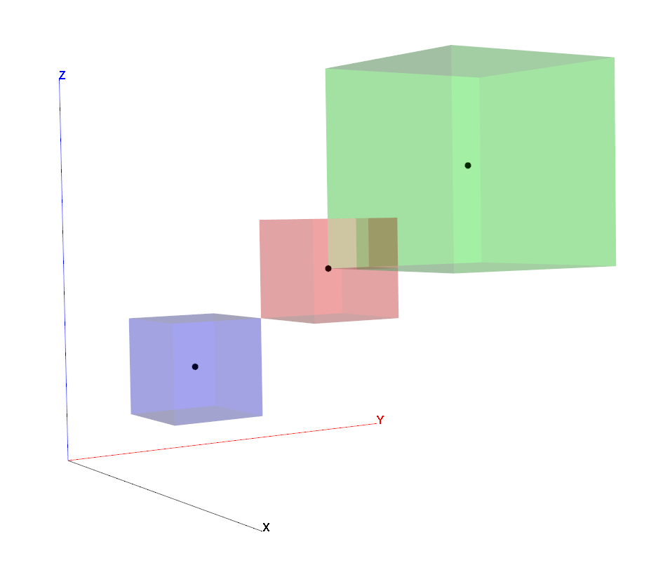
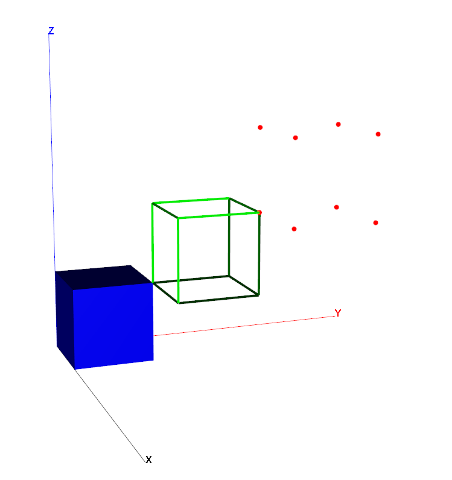
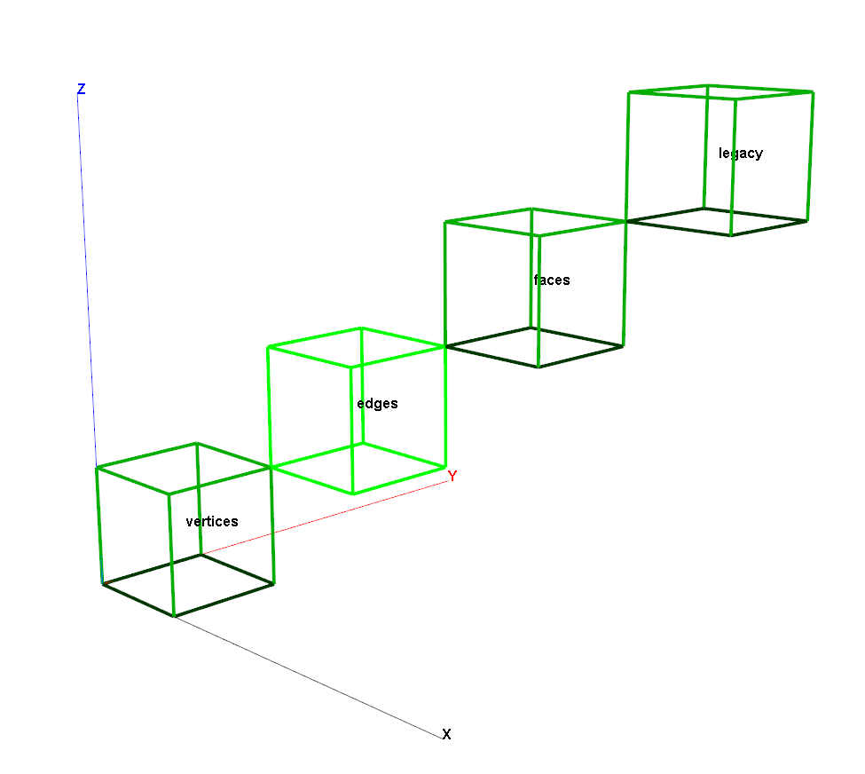
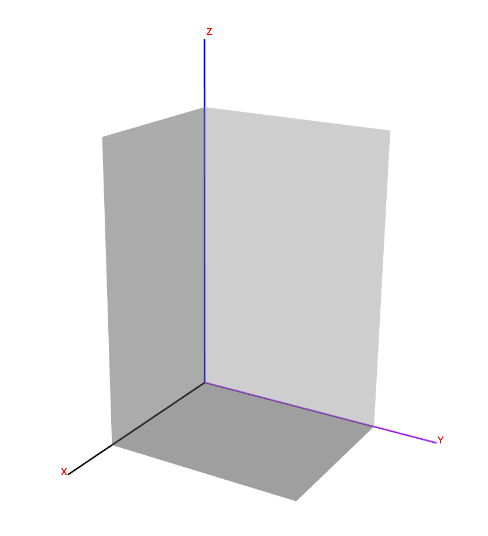
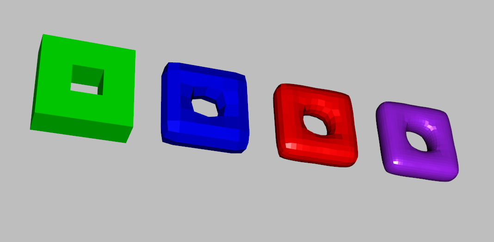
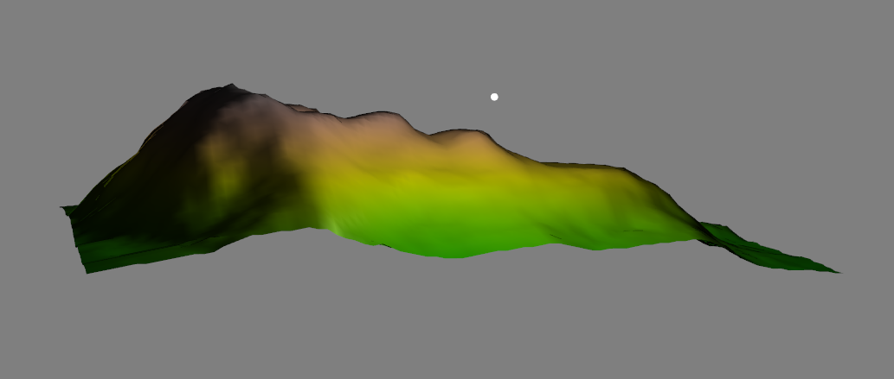
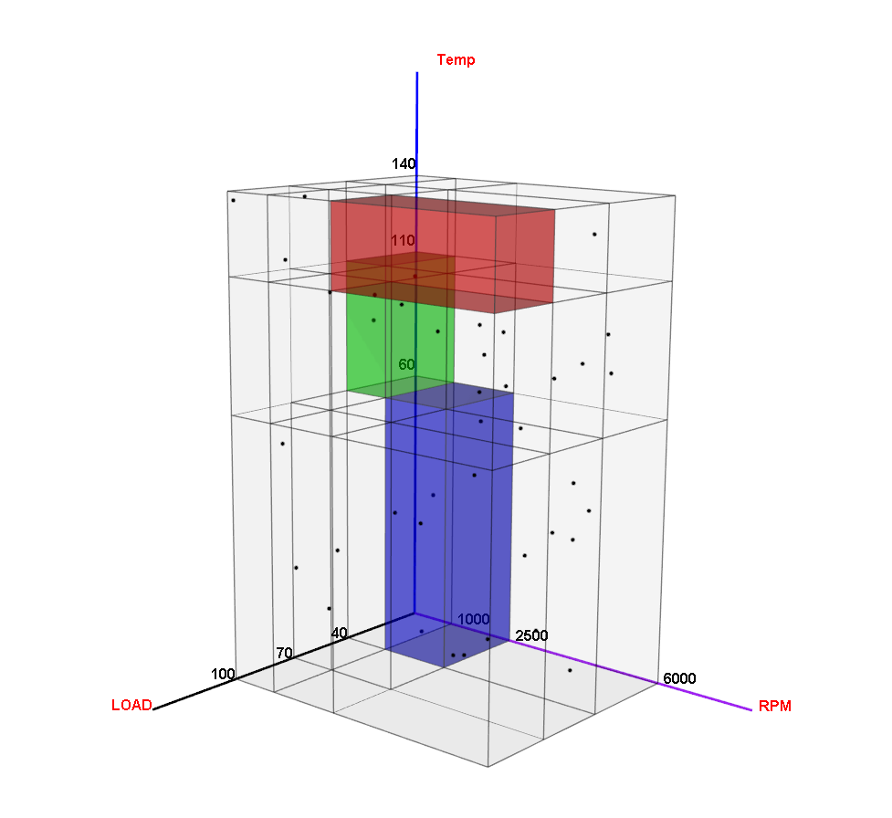

3D plots in R
================

## Example1: cubes

The package `rgl` can be used to draw many different 3D plots, including
cube, polygon, points, lines, and surfaces. We will focus on cubes.

Few key parameters to define the cubes:

1.  center: the cubes were defined by using centers and width of each
    coordinates.
2.  width: identify the width for x, y, z
3.  color: use “red” or “\#FF0000”
4.  alpha: how transparent can it be

Because we will use the `open3d()` to open interactive window, then I
will just paste a screenshot for result.

``` r
library(rgl)
library(knitr)

##define the location
grd <- expand.grid(x=seq(0,10,2.5), y=seq(0,10,2.5), z=seq(0,10,2.5))

grd$dist <- sqrt(grd$x^2 + grd$y^2 + grd$z^2) # distance to coordinate 0,0,0, but not used when plotting cubes.

grd$col <- rainbow(ceiling(max(grd$dist+1)))[ceiling(grd$dist+1)]
grd$alpha <- rep(c(0.2), nrow(grd))

open3d()
```

    ## wgl 
    ##   1

``` r
for(i in seq(nrow(grd))){
  shade3d( translate3d( cube3d(col = grd$col[i]), grd$x[i], grd$y[i], grd$z[i]) , alpha=grd$alpha[i])
}
```


``` r
grd[1:5, 1:ncol(grd)]
```

    ##      x y z dist       col alpha
    ## 1  0.0 0 0  0.0 #FF0000FF   0.2
    ## 2  2.5 0 0  2.5 #FFF200FF   0.2
    ## 3  5.0 0 0  5.0 #6BFF00FF   0.2
    ## 4  7.5 0 0  7.5 #00FF86FF   0.2
    ## 5 10.0 0 0 10.0 #00D7FFFF   0.2

Basically, we can see the `grd` is defining the center of each cube and
each cube’s width =2 (by default). That is the reason why cubes are
separated from each other. If I change the center of second cube from
(2.5, 0, 0)to (2, 0, 0), then, they will be connect to each other. Next
example can provide better understanding.

## Example 2: understanding the cube location

I will add the coordinates together with cubes, and add some points to
know where they are.

``` r
#open interactive window
open3d()
```

    ## wgl 
    ##   2

``` r
#draw coordinates
rgl.lines(c(0, 4), c(0, 0), c(0, 0), color = "black")  ##X-axis
text3d(4, 0, 0, "X", adj = c(0, 0), color = "black", family = "sans", font = 2, cex = 1, alpha = 1)

rgl.lines(c(0, 0), c(0, 4), c(0, 0), color = "red")  ##Y-axis
text3d(0, 4, 0, "Y", adj = c(0, 0), color = "red", family = "sans", font = 2, cex = 1, alpha = 1)

rgl.lines(c(0, 0), c(0, 0), c(0, 4), color = "blue")  ##Z-axis
text3d(0, 0, 4, "Z", adj = c(0, 0), color = "blue", family = "sans", font = 2, cex = 1, alpha = 1)

#draw few cubes, NOTE: the width is the distance from center to the edge, therefore, the cube will be 2*width big

#cube1
shade3d(translate3d(scale3d(cube3d(),0.5,0.5,0.5),1,1,1),col="blue", alpha= 0.2)  ##location (2, 2, 2), width=(1, 1, 1)
#cube2
shade3d(translate3d(scale3d(cube3d(),0.5,0.5,0.5),2,2,2),col="red", alpha= 0.2)  ##location (2, 2, 2), width=(1, 1, 1)
#cube3
shade3d(translate3d(scale3d(cube3d(),1,1,1),3,3,3),col="green", alpha= 0.2)  ##location (2, 2, 2), width=(1, 1, 1)

##add points

#center of cube1
rgl.points(x = 1, y=1, z=1, color = "black", size = 10, alpha = 1) #center of cube 1

#center of cube2
rgl.points(x = 2, y=2, z=2, color = "black", size = 10, alpha = 1) #center of cube 2

#center of cube3
rgl.points(x = 3, y=3, z=3, color = "black", size = 10, alpha = 1) #center of cube 3
```



In this plot, you can see, the cubes can overlap, it all depends on the
center and width of the cubes.

Besides, we also used lines, points, and text here.

## Example 3 : different cubes: points, line, and shaded

``` r
open3d()
```

    ## wgl 
    ##   3

``` r
##draw coordinates
rgl.lines(c(0, 8), c(0, 0), c(0, 0), color = "black")  ##X-axis
text3d(8, 0, 0, "X", adj = c(0, 0), color = "black", family = "sans", font = 2, cex = 1, alpha = 1)

rgl.lines(c(0, 0), c(0, 8), c(0, 0), color = "red")  ##Y-axis
text3d(0, 8, 0, "Y", adj = c(0, 0), color = "red", family = "sans", font = 2, cex = 1, alpha = 1)

rgl.lines(c(0, 0), c(0, 0), c(0, 8), color = "blue")  ##Z-axis
text3d(0, 0, 8, "Z", adj = c(0, 0), color = "blue", family = "sans", font = 2, cex = 1, alpha = 1)


shade3d(translate3d( cube3d(col = "blue"),1, 1,1))
wire3d(translate3d( cube3d(col = "green"),3, 3,3), lwd = 4)
dot3d(translate3d( cube3d(col = "red"),5, 5,5), size = 9)
```



You see how we change the cubes into points, lines, and shaded type.
Also, we can control the line width and point size.

In the `wire3d`, we can change how the color looks like. However, I did
not see much difference.

``` r
open3d()
```

    ## wgl 
    ##   4

``` r
##draw coordinates
rgl.lines(c(0, 8), c(0, 0), c(0, 0), color = "black")  ##X-axis
text3d(8, 0, 0, "X", adj = c(0, 0), color = "black", family = "sans", font = 2, cex = 1, alpha = 1)

rgl.lines(c(0, 0), c(0, 8), c(0, 0), color = "red")  ##Y-axis
text3d(0, 8, 0, "Y", adj = c(0, 0), color = "red", family = "sans", font = 2, cex = 1, alpha = 1)

rgl.lines(c(0, 0), c(0, 0), c(0, 8), color = "blue")  ##Z-axis
text3d(0, 0, 8, "Z", adj = c(0, 0), color = "blue", family = "sans", font = 2, cex = 1, alpha = 1)


wire3d(translate3d( cube3d(col = "green"),1, 1,1), lwd = 4, meshColor = "vertices")
text3d(1, 1, 1, "vertices", adj = c(0, 0), color = "black", family = "sans", font = 2, cex = 1, alpha = 1)
wire3d(translate3d( cube3d(col = "green"),3, 3,3), lwd = 4, meshColor = "edges")
text3d(3, 3, 3, "edges", adj = c(0, 0), color = "black", family = "sans", font = 2, cex = 1, alpha = 1)
wire3d(translate3d( cube3d(col = "green"),5, 5,5), lwd = 4, meshColor = "faces")
text3d(5, 5, 5, "faces", adj = c(0, 0), color = "black", family = "sans", font = 2, cex = 1, alpha = 1)
wire3d(translate3d( cube3d(col = "green"),7, 7,7), lwd = 4, meshColor = "legacy")
text3d(7, 7, 7, "legacy", adj = c(0, 0), color = "black", family = "sans", font = 2, cex = 1, alpha = 1)
```



## Example 4: adding surface

Use x, y, z coordinate to define the surface. However, draw horizontal
and vertical will be different. For example, draw horizontal surface, we
want to draw a surface between (0, 0, 0), (0, 2, 0), (2, 0, 0), and (2,
2, 0). This is a square with width =2. Then we will define as:

    x = c(0, 2)
    y = c(0, 2)
    z = matrix(c(0, 0, 0, 0), nrow = 2)

``` r
#EXAMPLE

open3d()
```

    ## wgl 
    ##   5

``` r
###fix xyz-axis
rgl.lines(c(0, 14), c(0, 0), c(0, 0), color = "black", lwd = 3)
rgl.lines(c(0, 0), c(0, 16), c(0, 0), color = "purple", lwd = 3)
rgl.lines(c(0, 0), c(0, 0), c(0, 22), color = "blue", lwd = 3)

text3d(14, 0, 0, "X", adj = c(1, 0), color = "red", family = "sans", font = 2, cex = 1, alpha = 1)
text3d(0, 16, 0, "Y", adj = c(-0.2, 0), color = "red", family = "sans", font = 2, cex = 1, alpha = 1)
text3d(0, 0, 22, "Z", adj = c(-0.5, -0.5), color = "red", family = "sans", font = 2, cex = 1, alpha = 1)


#the ground surface, order as x, y, z
surface3d(c(0, 10), c(0, 12), matrix(c(0, 0, 0, 0), nrow = 2), color = "grey", alpha = 0.5) #between X and Y

#the vertical surface, order input as: x, z, y
rgl.surface(c(0, 10), c(0, 18), matrix(c(0, 0, 0, 0), nrow = 2), color = "grey", alpha = 0.5) #between X and Z
rgl.surface(c(0, 0), c(0, 18), matrix(c(0, 12, 0, 12), nrow = 2), color = "grey", alpha = 0.5) #between Y and Z
```



## More examples

### 1\. more shapes

``` r
open3d()
```

    ## wgl 
    ##   6

``` r
bg3d("gray")  ##add the background to gray

l0 <- oh3d(tran = par3d("userMatrix"), color = "green" )
shade3d( translate3d( l0, -6, 0, 0 ))

l1 <- subdivision3d( l0 )
shade3d( translate3d( l1 , -2, 0, 0 ), color = "blue", override = TRUE)

l2 <- subdivision3d( l1 )
shade3d( translate3d( l2 , 2, 0, 0 ), color = "red", override = TRUE )

l3 <- subdivision3d( l2 )
shade3d( translate3d( l3 , 6, 0, 0 ), color = "purple" , override = TRUE)
```



### 2\. change direction of the light

``` r
##direction of light
data(volcano)
z <- 2 * volcano # Exaggerate the relief
x <- 10 * (1:nrow(z)) # 10 meter spacing (S to N)
y <- 10 * (1:ncol(z)) # 10 meter spacing (E to W)
zlim <- range(z)
zlen <- zlim[2] - zlim[1] + 1
colorlut <- terrain.colors(zlen) # height color lookup table
col <- colorlut[ z - zlim[1] + 1 ] # assign colors to heights for each point
open3d()
```

    ## wgl 
    ##   7

``` r
bg3d("gray50")
surface3d(x, y, z, color = col, back = "lines")
r <- max(y) - mean(y)
lightid <- spheres3d(1, 1, 1, alpha = 0)
frame <- function(time) {
  a <- pi*(time - 1)
  save <- par3d(skipRedraw = TRUE)
  clear3d(type = "lights")
  rgl.pop(id = lightid)
  xyz <- matrix(c(r*sin(a) + mean(x), r*cos(a) + mean(y), max(z)), ncol = 3)
  light3d(x = xyz, diffuse = "gray75",
          specular = "gray75", viewpoint.rel = FALSE)
  light3d(diffuse = "gray10", specular = "gray25")
  lightid <<- spheres3d(xyz, emission = "white", radius = 4)
  par3d(save)
  Sys.sleep(0.02)
  NULL
}
play3d(frame, duration = 2)
```



The white point is the source of the light.

### 3\. get color index

``` r
library(RColorBrewer)
brewer.pal(n = 9, name = 'Set1') #print out the color index
```

    ## [1] "#E41A1C" "#377EB8" "#4DAF4A" "#984EA3" "#FF7F00" "#FFFF33" "#A65628"
    ## [8] "#F781BF" "#999999"

``` r
display.brewer.pal(n = 9, name = 'Set1') #visualize
```

<!-- -->

## My own project final looks like

``` r
#uneven separate a big cube to 27 smaller one.
x_v = c(0, 4, 7, 10)
y_v = c(0, 2, 5, 12)
z_v = c(0, 10, 15, 18)

#define the point (one cube has 8 points to define their position) closest and farest to the (0,0,0)
x_start = c()
y_start = c()
z_start = c()
x_end = c()
y_end = c()
z_end = c()

for (i in 1:3){
  for (j in 1:3){
    for (k in 1:3){
      
      ##define the starting point
      x_start = c(x_start, x_v[i])
      y_start = c(y_start, y_v[j])
      z_start = c(z_start, z_v[k])
      
      #define the end point, move one for all
      x_end = c(x_end, x_v[i + 1])
      y_end = c(y_end, y_v[j + 1])
      z_end = c(z_end, z_v[k + 1])
      
    }
  }
}

cubes = data.frame("x_start" = x_start,
                   "x_end" = x_end,
                   "y_start" = y_start, 
                   "y_end" = y_end,
                   "z_start" = z_start, 
                   "z_end" = z_end)

#based on cube start and end points, calculate location and cube width
cubes[1:nrow(cubes), 7] = (x_end - x_start)/2 + x_start
cubes[1:nrow(cubes), 8] = (y_end - y_start)/2 + y_start
cubes[1:nrow(cubes), 9] = (z_end - z_start)/2 + z_start

cubes[1:nrow(cubes), 10] = (x_end - x_start)/2
cubes[1:nrow(cubes), 11] = (y_end - y_start)/2
cubes[1:nrow(cubes), 12] = (z_end - z_start)/2

colnames(cubes) = c("x_start" ,"x_end"  , "y_start", "y_end" ,  "z_start", "z_end", 
                    "center_x", "center_y", "center_z", "width_x", "width_y", "width_z")

##cubes determine the location of these 27 smaller cubes
cubes[1:3, 1:12]
```

    ##   x_start x_end y_start y_end z_start z_end center_x center_y center_z width_x
    ## 1       0     4       0     2       0    10        2        1      5.0       2
    ## 2       0     4       0     2      10    15        2        1     12.5       2
    ## 3       0     4       0     2      15    18        2        1     16.5       2
    ##   width_y width_z
    ## 1       1     5.0
    ## 2       1     2.5
    ## 3       1     1.5

``` r
open3d()
```

    ## wgl 
    ##   8

``` r
## add coordinates
rgl.lines(c(0, 14), c(0, 0), c(0, 0), color = "black", lwd = 3)
rgl.lines(c(0, 0), c(0, 16), c(0, 0), color = "purple", lwd = 3)
rgl.lines(c(0, 0), c(0, 0), c(0, 22), color = "blue", lwd = 3)

##use wire3d to draw the structure of 27 cubes
for ( i in 1:nrow(cubes)){
  wire3d(translate3d(scale3d(cube3d(), cubes$width_x[i], cubes$width_y[i] , cubes$width_z[i]),
                      cubes$center_x[i], cubes$center_y[i], cubes$center_z[i]),
          col="black", alpha= 0.5, lwd = 1.5, override = TRUE)
}

##mark out specific cube
##idling cube
i =2
shade3d(translate3d(scale3d(cube3d(), cubes$width_x[i], cubes$width_y[i] , cubes$width_z[i]),
                    cubes$center_x[i], cubes$center_y[i], cubes$center_z[i]),
        col= "green", alpha= 0.4, override = TRUE)
## cold cube
i = 4
shade3d(translate3d(scale3d(cube3d(), cubes$width_x[i], cubes$width_y[i] , cubes$width_z[i]),
                      cubes$center_x[i], cubes$center_y[i], cubes$center_z[i]),
          col= "blue", alpha= 0.4, override = TRUE)
#hot cube
i = 27
shade3d(translate3d(scale3d(cube3d(), cubes$width_x[i], cubes$width_y[i] , cubes$width_z[i]),
                    cubes$center_x[i], cubes$center_y[i], cubes$center_z[i]),
        col= "red", alpha= 0.4, override = TRUE)

##add label and ticks
text3d(14, 0, 0, "LOAD", adj = c(1, 0), color = "red", family = "sans", font = 2, cex = 1, alpha = 1)
text3d(0, 16, 0, "RPM", adj = c(-0.2, 0), color = "red", family = "sans", font = 2, cex = 1, alpha = 1)
text3d(0, 0, 22, "Temp", adj = c(-0.5, -0.5), color = "red", family = "sans", font = 2, cex = 1, alpha = 1)


text3d(4, 0, 0, "40", adj = c(1, 0), color = "black", family = "sans", font = 2, cex = 1, alpha = 1)
text3d(7, 0, 0, "70", adj = c(1, 0), color = "black", family = "sans", font = 2, cex = 1, alpha = 1)
text3d(10, 0, 0, "100", adj = c(1, 0), color = "black", family = "sans", font = 2, cex = 1, alpha = 1)

text3d(0,  2,0, "1000", adj = c(-0.2,0 ), color = "black", family = "sans", font = 2, cex = 1, alpha = 1)
text3d(0, 5,0, "2500", adj = c(-0.2, 0), color = "black", family = "sans", font = 2, cex = 1, alpha = 1)
text3d(0,  12,0, "6000", adj = c(-0.2, 0), color = "black", family = "sans", font = 2, cex = 1, alpha = 1)


text3d(0, 0, 10, "60", adj = c(1, -0.5), color = "black", family = "sans", font = 2, cex = 1, alpha = 1)
text3d(0, 0, 15, "110", adj = c(1, -0.5), color = "black", family = "sans", font = 2, cex = 1, alpha = 1)
text3d(0, 0, 18, "140", adj = c(1, -0.5), color = "black", family = "sans", font = 2, cex = 1, alpha = 1)


##color the surface
surface3d(c(0, 10), c(0, 12), matrix(c(0, 0, 0, 0), nrow = 2), color = "grey", alpha = 0.1)
rgl.surface(c(0, 10), c(0, 18), matrix(c(0, 0, 0, 0), nrow = 2), color = "grey", alpha = 0.1)
rgl.surface(c(0, 0), c(0, 18), matrix(c(0, 12, 0, 12), nrow = 2), color = "grey", alpha = 0.1)

#add random walk points
points3d(x = sample(0:100, 40)/10, y = sample(0:120, 40)/10, z = sample(0:180, 40)/10, color = "black", size = 5, alpha = 1)
```


